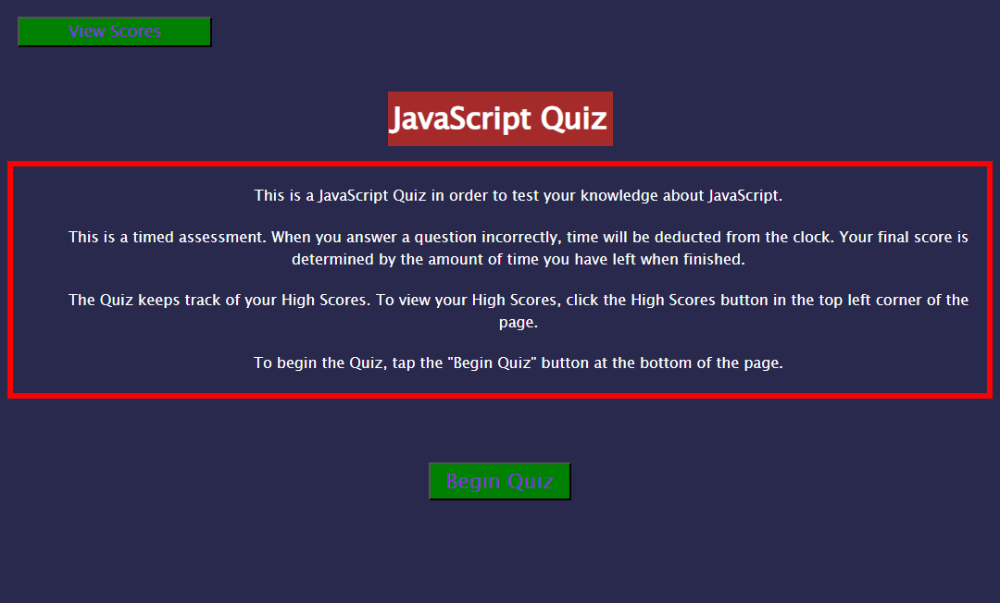

# javascript-Quiz

## Description

This web application is a quiz on Javascript. The purpose is to work with html, css, javascript functions and Web-APIs. 

Throughout the project I worked with various functions and methods in order to achieve proper navigation and functionality. I also had to work with many different variables and decide if they should be globally defined. I worked in html, css and js in order to build this application from the ground up.

## Instalation

This entire project was made in Visual Studio. We were provided an example of an application from the UCSD Extended Studies Coding Bootcamp, which I drew inspiration from as I created my js Quiz. 

## Usage

The final product looks like this:

If you click the view highscores button, the application will take you to a page where you can see your most recent score, and the initials of the user.

If you click the Begin Quiz button, you will be prompted to enter your initials, then the Quiz and timer will begin.

For every question you get right, the timer decrements normally. For every question you get wrong, the timer will decrement by 10 seconds. The user's final score is the amount of time the user has remaining when they finish the quiz. So if the user had 50 seconds left when they finished the quiz, their final score would be 50. 

If the user runs out of time mid quiz, they will recieve a score of 0 and the quiz will be terminated.

Here is a link to the completed web application:

https://cjfeagin33.github.io/javascript-Quiz/

## Credit

This application was built with assistance from my peers and instructors within the UCSD Extended Studies Coding Bootcamp.